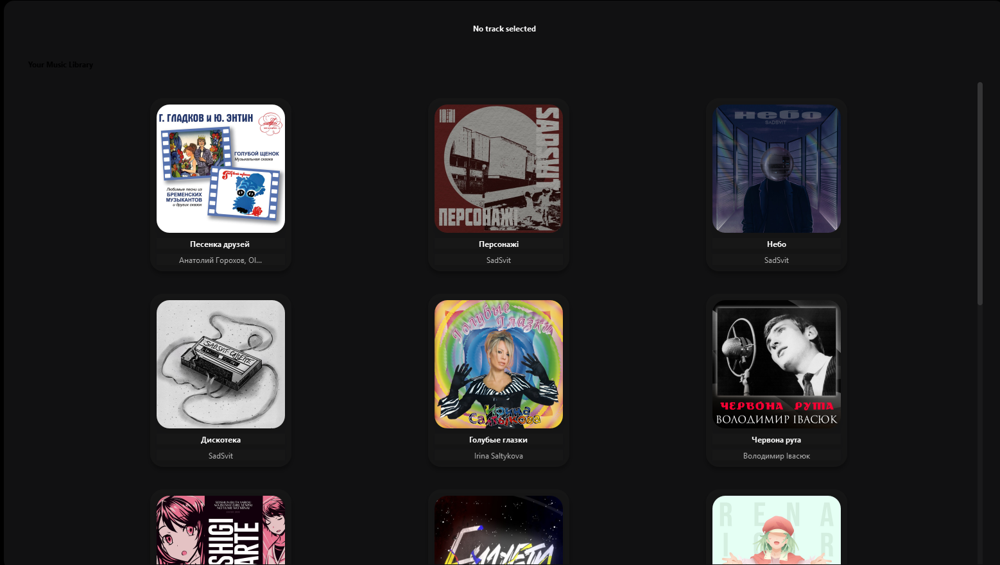
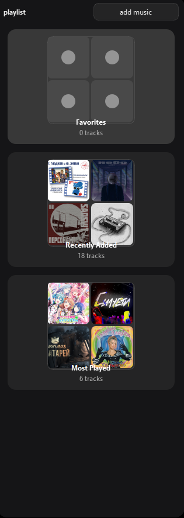
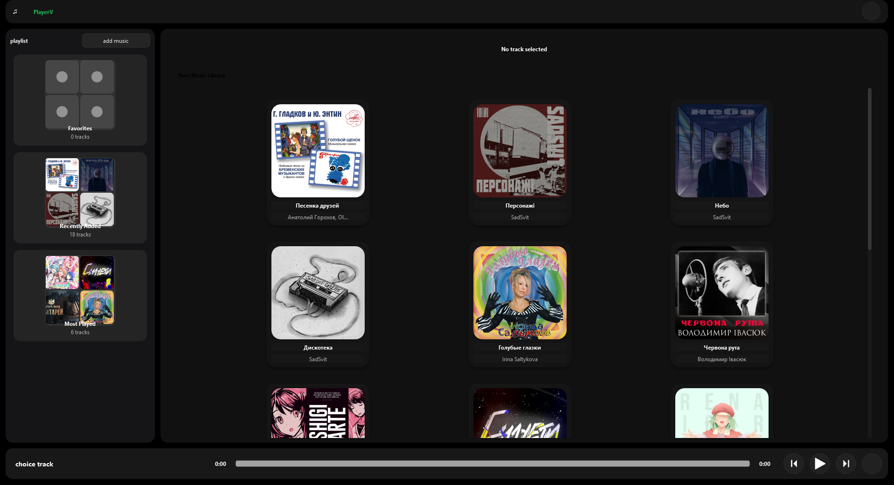

# PlayerV
   

A minimal and informative music player application with a graphical user interface. The app features vibrant colors and a sleek design for an enhanced user experience.

## Features
- Play, pause, next, and previous track controls
- Playlist management
- Settings page for customization
- Support for multiple audio engines (Qt and VLC)
- Music library with covers
- Vibrant and colorful UI

## Performance
- **Memory Usage**: ~60 MB RAM
- **CPU Usage**: 0.2-1% on an Intel i5-12400F

## Screenshots

| Home Page | Playlist |
|-----------|----------|
|  |  |

| Bar | All |
|-----|-----|
|  |  |

## Color Scheme

The application uses a modern and vibrant color scheme:

- **Primary Color**: `#4CAF50` (Green)
- **Secondary Color**: `#2196F3` (Blue)
- **Accent Color**: `#FFC107` (Amber)
- **Background**: `#121212` (Dark)
- **Text**: `#FFFFFF` (White)

### Color Palette

  

  

  

  

  

## Color Scheme
The application uses a modern and vibrant color scheme:
- **Primary Color**: `#4CAF50` (Green)
- **Secondary Color**: `#2196F3` (Blue)
- **Accent Color**: `#FFC107` (Amber)
- **Background**: `#121212` (Dark)
- **Text**: `#FFFFFF` (White)

## Project Structure
- `main.py`: Entry point of the application
- `gui_base/`: Contains GUI-related files
  - `home_page.py`: Main home page
  - `playlist_page.py`: Playlist management page
  - `settings_page.py`: Settings page
- `engine_sound/`: Audio engine implementations
  - `AudioEngineQt.py`: Qt-based audio engine
  - `AudioEngineVLC.py`: VLC-based audio engine
- `assets/`: UI assets like buttons and icons
- `music/`: Music library
- `covers/`: Album covers

## Getting Started
1. Clone the repository
2. Install the required dependencies
3. Run `main.py` to start the application

## Dependencies
- Python 3.x
- PySide6 (for GUI)
- VLC (for VLC audio engine)

## License
the MIT License.
